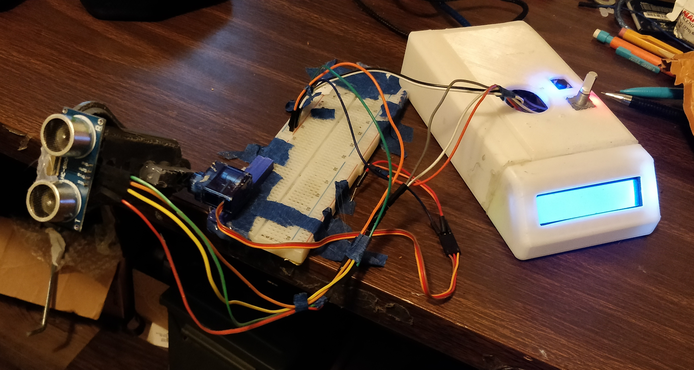

# ultrasonic_object_detection
HC-SR04 and SG90 Object Detection/Rangefinder

This is a work in progress. Below is an image of the system.

This will be incorporated into a large project, where I'm trying to reverse engineer a v3s iLife robotic Vacuum.
